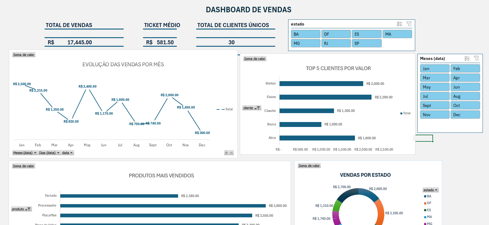

## 📸 Dashboard

#  Dashboard de Vendas

## Objetivo
Analisar dados de vendas para identificar padrões de consumo, clientes mais relevantes e desempenho por período.

## 🛠️ Ferramentas utilizadas
- SQL
- Excel

##  Análises realizadas
- Total de vendas 
- Vendas por Cliente
- Vendas por mês
- Vendas por Estado
- Top clientes

##  Insights
- Os 5 principais clientes concentram a maior parte da receita
- Determinados meses apresentam maior volume de vendas
- Alguns produtos dominam o faturamento total

##  Arquivos
- dados.csv → base de dados
- queries.sql → consultas SQL
- dashboard.xlsx → dashboard final
